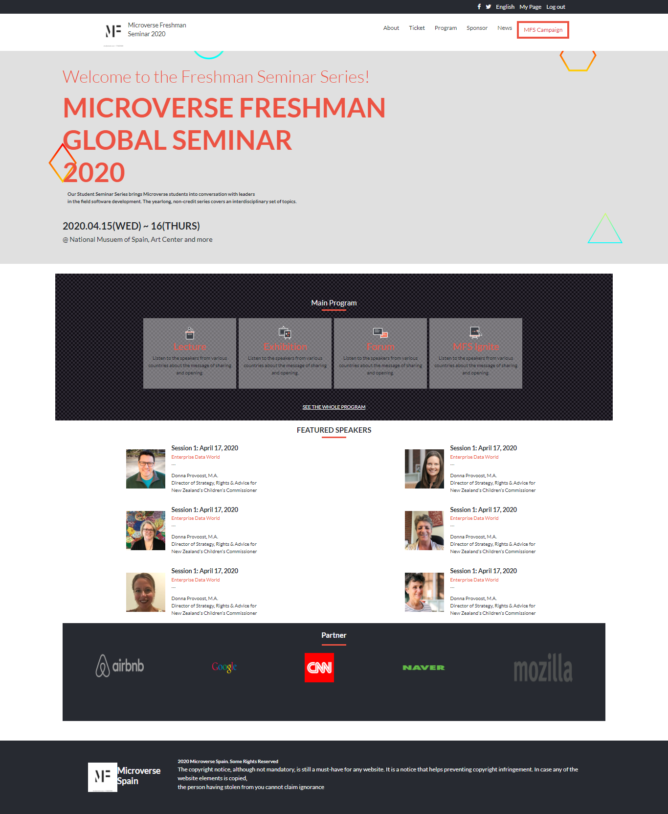

Newsweek clone
What the project is about

An online website conference built with HTML and CSS. The design idea for the website is borrowed from Cindy Shin in behance(https://www.behance.net/gallery/29845175/CC-Global-Summit-2015)

I use Bootstrap framework for responsive design.

## Built With
html, css
Bootstrap

## Live Demo
[Live Demo Link](https://rawcdn.githack.com/blackpintz/newsweek-clone/1cab0c2314ed68657da922705f57b753ce97b4a8/index.html)

## Getting Started
To get a local copy up and running follow these simple example steps.

## Prerequisites
Web browser
Code editor
Git and Github

## Usage
Clone the project to your local machine
Open the index file in your browser

## Authors

- Github: [Rose Wanjohi](https://github.com/blackpintz)
- Twitter: [Rose Wanjohi](https://twitter.com/blackpintz)

## 🤝 Contributing
Feel free to check the [issues page](https://github.com/blackpintz/microverse-seminar-2020/issues).

Contributions, issues and feature requests are welcome!

Start by:

* Forking the project
* Cloning the project to your local machine
* `cd` into the project directory
* Run `git checkout -b your-branch-name`
* Make your contributions
* Push your branch up to your forked repository
* Open a Pull Request with a detailed description to the development branch of the original project for a review

## Show your support

Give a ⭐️ if you like this project!

## 📝 License

This project is [MIT](lic.url) licensed.